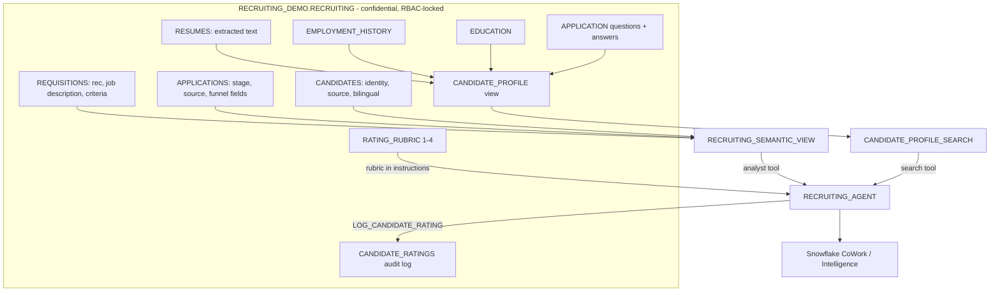

# Recruiting Candidate Review Agent (Snowflake + Cortex)

A reusable template for a recruiter-facing Cortex Agent that triages large applicant pools
for a requisition. A recruiter names a rec (for example `R-3183`), optionally adds ad-hoc
criteria, and gets a per-candidate **1-4 fit rating** with a summary and supporting evidence,
plus rec-level pipeline analytics. The agent is **assistive only**: it never makes hiring
decisions, never auto-rejects, and keeps a human in the loop on every candidate.

Everything ships with synthetic data (a fictional "Acme Health" plan) so it can be shared and
demoed safely. To use it for a real organization, point the same objects at your HRIS feed
(for example a Workday report) instead of the synthetic seed.

---

## Architecture



The agent uses three tools: **Cortex Analyst** over the semantic view (counts, stage/source
breakdowns, funnel metrics, JD + criteria lookup), **Cortex Search** over the assembled
candidate profile text, and a **chart** tool. The 1-4 rubric and all guardrails live in the
agent instructions, so ratings are computed consistently and never taken from the recruiter's
prompt.

---

## Repository contents

| Path | Purpose | Production? |
|---|---|---|
| `sql/01_setup_database_rbac.sql` | Database, confidential schema, least-privilege role (no PUBLIC) | Reusable |
| `sql/02_create_tables.sql` | 9-table data model mirroring a typical HRIS candidate report | Reusable (match to your columns) |
| `sql/03_seed_structured_data.sql` | Rubric + 5 sample recs + ~400 synthetic candidates/apps + funnel/bilingual fields | Demo-only |
| `sql/04_generate_text_aisql.sql` | Synthetic resume + answer text via `AI_COMPLETE` (uses AI credits) | Demo-only |
| `sql/05_candidate_profile_and_search.sql` | `CANDIDATE_PROFILE` view + `CANDIDATE_PROFILE_SEARCH` Cortex Search service | Reusable |
| `sql/06_semantic_view.sql` | `RECRUITING_SEMANTIC_VIEW` (counts, funnel, bilingual, JD/criteria) | Reusable |
| `sql/07_ratings_persistence.sql` | `CANDIDATE_RATINGS` audit table + `LOG_CANDIDATE_RATING` procedure | Reusable |
| `sql/run_all.sql` | One-shot: runs 01-07 + creates the agent (synthetic demo build) | Demo convenience |
| `agent_spec.json` | Cortex Agent specification (guided workflow, rubric, guardrails, tools) | Reusable |
| `demo/prompts.md` | Copy-paste demo prompts / run-of-show | Reference |

The sample data uses healthcare roles (RN Care Manager, etc.) purely as an illustrative
scenario. Swap the reqs, criteria, and roles in `03`/`04` for any industry.

---

## Prerequisites

- A Snowflake account with Cortex (Analyst, Search, Agents) enabled.
- A warehouse for the agent runtime (this build uses `SNOWFLAKE_INTELLIGENCE_WH`).
- Privilege to create databases, roles, semantic views, Cortex Search services, and agents
  (this build runs as `ACCOUNTADMIN`; scope down as appropriate).
- Snowflake CLI (`snow`) configured with a connection.

---

## Run order

**Quick start (full synthetic demo, one command):**

```
snow sql -c <your_connection> -f sql/run_all.sql
```

`sql/run_all.sql` runs steps 01-07 and creates the agent in one shot. It builds the
synthetic "Acme Health" demo (steps 03-04 fabricate candidates and use AI credits), so use
it for demos/evaluation. For a real deployment, run the scripts individually as below and
skip 03/04 (see "Repoint to your real data").

**Step by step:** run the SQL scripts in order under a role that can create the objects:

```
01  setup_database_rbac        -- db, confidential schema, RECRUITING_CONFIDENTIAL_RL role
02  create_tables              -- data model
03  seed_structured_data       -- DEMO ONLY: synthetic recs/candidates + funnel/bilingual
04  generate_text_aisql        -- DEMO ONLY: synthetic resume/answer text (AI credits)
05  candidate_profile_and_search
06  semantic_view
07  ratings_persistence
```

Then create the agent from the spec (replace object names if you changed them):

```sql
CREATE OR REPLACE AGENT SNOWFLAKE_INTELLIGENCE.AGENTS.RECRUITING_AGENT
  WITH PROFILE='{"display_name":"Recruiting Candidate Review Assistant"}'
  COMMENT='Assists recruiters in triaging applicant pools with 1-4 fit ratings. Human-in-the-loop.'
  FROM SPECIFICATION $$ <paste contents of agent_spec.json> $$;

GRANT USAGE ON AGENT SNOWFLAKE_INTELLIGENCE.AGENTS.RECRUITING_AGENT
  TO ROLE RECRUITING_CONFIDENTIAL_RL;
```

The agent appears in **CoWork / Snowflake Intelligence** (ai.snowflake.com) as
"Recruiting Candidate Review Assistant" for anyone granted the confidential role.

---

## Repoint to your real data

To move from this demo to a real HRIS feed, **skip `03` and `04`** (they only fabricate
synthetic candidates) and:

1. **Land the HRIS/Workday feed** into the confidential schema. Either match the `02` table
   shapes, or adjust `02` to your columns. The funnel fields (`no_show_flag`, `offer_date`,
   `start_date`, `disposition_reason`) and `bilingual` come from your source system in
   production, not from the demo's HASH-based seeding in `03`. Add the job description to the
   requisition feed.
2. **Change the object names** where they are hard-coded:
   - `USE DATABASE` / `USE SCHEMA` at the top of each script, and the confidential role name
     `RECRUITING_CONFIDENTIAL_RL`.
   - Fully-qualified references in `05` (search source table), `06` (semantic view table refs),
     and `agent_spec.json` -> `tool_resources` (the `semantic_view` and `search_service` FQNs,
     and the runtime `warehouse`).
3. **Re-run** `05`, `06`, `07`, then create the agent. The rubric and guardrails in
   `agent_spec.json` carry over unchanged.
4. **Tune the agent instructions** in `agent_spec.json`: replace the sample-scenario signals
   (Medicare Advantage, telehealth, bilingual, etc.) with the criteria that matter for your
   roles, and paste your finalized 1-4 rubric wording if it differs from the defaults.

---

## Guardrails and governance (by design)

- **Human-in-the-loop.** The agent summarizes and prioritizes only; it declines any request to
  auto-reject, filter people out, or make a final decision. Recruiters review every candidate.
- **Rating, not ranking.** Each candidate is rated 1-4 on their own merits against the criteria,
  not stack-ranked against each other.
- **No protected characteristics.** Ratings are based only on job-relevant evidence.
- **Consistency.** The rubric is fixed in the agent, so every candidate on a rec is judged the
  same way regardless of which recruiter runs it.
- **Confidential RBAC.** All objects are reachable only through a dedicated least-privilege
  role; PUBLIC is never granted.
- **Auditability.** `CANDIDATE_RATINGS` logs every rating with its evidence, the criteria used,
  who ran it, and when.

---

## Extension ideas (not built in this template)

- **HRIS write-back (bidirectional).** Push the rating + evidence from `CANDIDATE_RATINGS`
  back onto the rec in your HRIS so recruiters sort/disposition there and trigger tracked
  candidate communications from the system of record.
- **MCP actions.** Slack (post a shortlist to a recruiting channel) and Gmail/Outlook (draft
  outreach), all human-approved.
- **Rec-level funnel deep dives.** Post-mortem analytics per rec (drop-off, no-show,
  offer-to-start attrition, hire-buffer math), which the `06` metrics already support.
- **Performance & internal mobility.** Reuse the same pattern on performance and skills data to
  match internal candidates to open roles.
- **Employee HR assistant.** A benefits/PTO/policy chatbot over your HR knowledge base, using
  the same Cortex Search + Agent building blocks.
